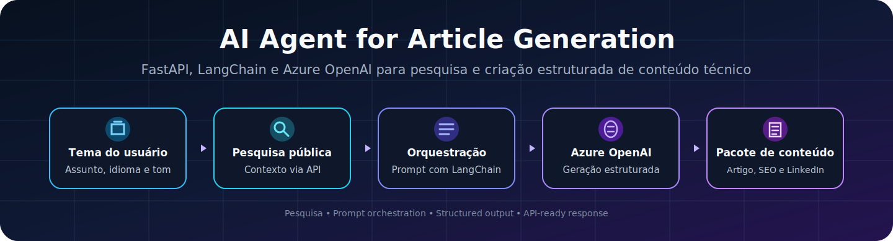
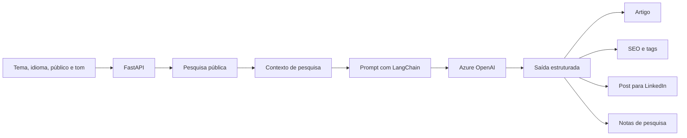

<p align="center">
  
</p>

<h1 align="center">AI Agent for Article Generation</h1>

<p align="center">
  Agente de IA em Python que pesquisa um tema, organiza contexto e gera um pacote estruturado de conteúdo técnico usando FastAPI, LangChain e Azure OpenAI.
</p>

<p align="center">
  
  
  
  
  <a href="https://github.com/cmosantos/ai-agent-article-generation/actions/workflows/tests.yml">
    
  </a>
</p>

---

## Visão geral

Este projeto demonstra como um agente de IA pode apoiar a criação de conteúdo técnico sem se limitar a gerar apenas um bloco de texto.

A API recebe um tema e informações opcionais sobre idioma, público e tom. Em seguida, realiza uma pesquisa pública básica, constrói um prompt estruturado, envia o contexto ao Azure OpenAI e retorna um pacote completo pronto para ser revisado ou conectado a outras automações.

O resultado inclui:

- título e subtítulo;
- público-alvo;
- resumo do artigo;
- descrição para SEO;
- palavras-chave;
- tags para Hashnode;
- estrutura do conteúdo;
- artigo completo;
- publicação para LinkedIn;
- notas de pesquisa com fontes;
- status do rascunho.

> O agente produz um rascunho estruturado. A revisão humana continua sendo necessária antes da publicação.

---

## Valor para o negócio

O projeto representa um caso de uso prático para equipes e profissionais que produzem conteúdo técnico com frequência.

Ele pode ajudar a:

- reduzir o tempo gasto na preparação inicial de artigos;
- padronizar títulos, resumos, SEO e tags;
- reaproveitar um mesmo tema em diferentes canais;
- fornecer uma saída JSON pronta para integrações;
- apoiar fluxos editoriais com revisão humana;
- conectar geração de conteúdo a n8n, Power Automate ou outras plataformas.

---

## Arquitetura



A documentação detalhada está em [`docs/architecture.md`](./docs/architecture.md).

---

## Como o agente funciona

### 1. Recebe a solicitação

A entrada é validada pelo modelo `ArticleRequest`:

```json
{
  "topic": "Como agentes de IA estão sendo usados no suporte técnico",
  "language": "Portuguese",
  "audience": "Profissionais de tecnologia e suporte",
  "tone": "Profissional, humano e prático"
}
```

### 2. Pesquisa contexto público

A função `research_topic` consulta a API pública da Wikipedia e coleta até três resultados relacionados ao tema.

O contexto é usado apenas como apoio. O prompt determina que o modelo não deve inventar fontes, estudos, links ou estatísticas.

### 3. Organiza o prompt

O LangChain combina:

- regras editoriais;
- tema informado;
- idioma;
- público-alvo;
- tom de escrita;
- contexto da pesquisa.

### 4. Gera conteúdo estruturado

O Azure OpenAI processa o prompt e o método `with_structured_output` força a resposta a seguir o modelo `ArticleResponse`.

### 5. Retorna JSON pronto para integração

A API devolve um objeto padronizado que pode ser consumido por aplicações, workflows ou interfaces.

---

## Tecnologias

| Tecnologia | Função no projeto |
|---|---|
| Python | Linguagem principal |
| FastAPI | Exposição da API e documentação Swagger |
| Pydantic | Validação dos modelos de entrada e saída |
| LangChain | Orquestração do prompt e structured output |
| Azure OpenAI | Geração do conteúdo |
| Requests | Consulta à API pública da Wikipedia |
| python-dotenv | Carregamento das variáveis de ambiente |
| Uvicorn | Execução do servidor ASGI |

---

## Endpoints

### Health check

```http
GET /
```

Resposta:

```json
{
  "status": "running",
  "service": "AI Article Generation Agent"
}
```

### Gerar artigo

```http
POST /generate-article
```

Exemplo com `curl`:

```bash
curl -X POST "http://127.0.0.1:8000/generate-article" \
  -H "Content-Type: application/json" \
  -d '{
    "topic": "Local AI versus cloud AI",
    "language": "English",
    "audience": "Technology professionals",
    "tone": "Professional, practical and human"
  }'
```

A referência completa está em [`docs/api-reference.md`](./docs/api-reference.md).

---

## Estrutura da resposta

```json
{
  "article_title": "...",
  "article_subtitle": "...",
  "target_audience": "...",
  "article_summary": "...",
  "seo_description": "...",
  "keywords": ["..."],
  "hashnode_tags": ["..."],
  "article_outline": ["..."],
  "full_article": "...",
  "linkedin_post": "...",
  "research_notes": [
    {
      "title": "...",
      "snippet": "...",
      "url": "..."
    }
  ],
  "status": "Draft"
}
```

---

## Como executar

### 1. Clone o repositório

```bash
git clone https://github.com/cmosantos/ai-agent-article-generation.git
cd ai-agent-article-generation
```

### 2. Crie o ambiente virtual

Windows PowerShell:

```powershell
python -m venv .venv
.\.venv\Scripts\Activate.ps1
```

Linux ou macOS:

```bash
python3 -m venv .venv
source .venv/bin/activate
```

### 3. Instale as dependências

```bash
pip install -r requirements.txt
```

### 4. Configure o ambiente

Copie o arquivo de exemplo:

```powershell
Copy-Item .env.example .env
```

No Linux ou macOS:

```bash
cp .env.example .env
```

Preencha as variáveis:

```env
AZURE_OPENAI_API_KEY=your_azure_openai_api_key_here
AZURE_OPENAI_ENDPOINT=https://your-resource-name.openai.azure.com/
AZURE_OPENAI_DEPLOYMENT=your-deployment-name-here
AZURE_OPENAI_API_VERSION=2024-10-21
```

> A versão da API deve ser compatível com o recurso e com o deployment configurado na sua conta Azure.

### 5. Inicie a API

```bash
uvicorn app.main:app --reload
```

Acesse:

```text
API:     http://127.0.0.1:8000
Swagger: http://127.0.0.1:8000/docs
```

---

## Testes automatizados

Execute localmente:

```bash
python -m unittest discover -s tests -v
```

Os testes verificam:

- funcionamento do health check;
- valores padrão da requisição;
- leitura das variáveis de ambiente;
- erro quando uma configuração obrigatória está ausente;
- conversão dos resultados da Wikipedia;
- comportamento seguro quando a pesquisa externa falha.

O GitHub Actions executa os testes automaticamente em cada `push` e `pull request` para a branch `main`.

---

## Estrutura do projeto

```text
ai-agent-article-generation/
├── .github/
│   └── workflows/
│       └── tests.yml
├── app/
│   └── main.py
├── assets/
│   └── ai-article-agent-banner.svg
├── docs/
│   ├── api-reference.md
│   └── architecture.md
├── tests/
│   └── test_main.py
├── .env.example
├── .gitignore
├── requirements.txt
└── README.md
```

---

## Segurança e uso responsável

- nunca publique chaves do Azure OpenAI;
- mantenha o arquivo `.env` fora do GitHub;
- valide os links e as fontes antes da publicação;
- revise o conteúdo para evitar erros técnicos ou informações desatualizadas;
- não trate a saída do modelo como conteúdo final sem avaliação humana;
- monitore custos e limites do recurso Azure OpenAI.

---

## Limitações atuais

- a pesquisa está limitada à API da Wikipedia;
- o agente não armazena histórico de artigos;
- a API ainda não possui autenticação;
- não existe interface gráfica;
- o fluxo depende de um deployment ativo no Azure OpenAI;
- a geração pode variar conforme o modelo utilizado.

---

## Próximas evoluções

- integração com Bing Search, Tavily ou Azure AI Search;
- persistência de rascunhos em banco de dados;
- autenticação e controle de uso;
- integração com Hashnode, LinkedIn, WordPress e n8n;
- histórico e versionamento de conteúdo;
- interface web para envio de temas;
- avaliação automática de qualidade e segurança.

---

## Autor

**Cláudio Santos**

---

<p align="center">
  Projeto desenvolvido para demonstrar APIs, agentes de IA, prompt orchestration e geração estruturada de conteúdo técnico.
</p>
