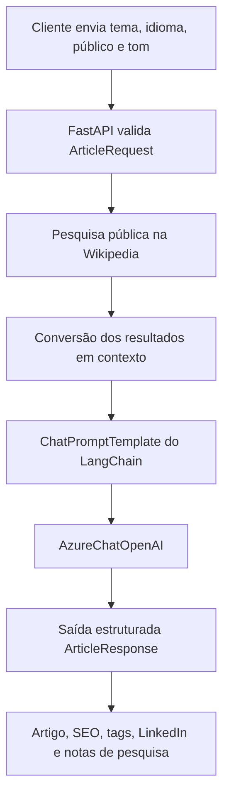

# Arquitetura do agente de geração de artigos

## Objetivo

O projeto expõe uma API que recebe um tema e transforma essa entrada em um pacote estruturado de conteúdo técnico. O fluxo combina pesquisa pública, engenharia de prompt, geração com Azure OpenAI e validação de saída com Pydantic.

## Fluxo principal

## Componentes

### `ArticleRequest`

Modelo de entrada com:

- tema;
- idioma;
- público-alvo;
- tom de escrita.

### `research_topic`

Realiza uma pesquisa simples na API pública da Wikipedia. Os três primeiros resultados são convertidos em título, resumo e URL para compor o contexto do prompt.

Quando a pesquisa falha, o fluxo continua sem contexto externo e instrui o modelo a não inventar fontes.

### `get_llm`

Cria o cliente `AzureChatOpenAI` utilizando as variáveis de ambiente do Azure OpenAI.

### Prompt orchestration

O `ChatPromptTemplate` define regras para:

- não inventar estudos, links ou estatísticas;
- evitar cópia direta do contexto;
- escrever de forma humana e discursiva;
- criar introdução, desenvolvimento e conclusão;
- retornar todos os campos do pacote de conteúdo.

### Structured output

O método `with_structured_output` exige que a resposta siga o modelo `ArticleResponse`, reduzindo inconsistências na integração com outras ferramentas.

## Decisões técnicas

- **FastAPI:** fornece API e documentação Swagger automaticamente.
- **Pydantic:** valida entrada e saída.
- **LangChain:** organiza o prompt e a chamada ao modelo.
- **Azure OpenAI:** executa a geração do conteúdo.
- **Wikipedia API:** demonstra enriquecimento com fonte pública sem exigir uma chave adicional.

## Limitações

- a pesquisa atual é simples e limitada à Wikipedia;
- não há persistência de artigos;
- não existe autenticação na API;
- a qualidade final depende do modelo e do contexto disponível;
- o conteúdo gerado deve passar por revisão humana antes da publicação.

## Evoluções possíveis

- integrar Tavily, Bing Search ou Azure AI Search;
- armazenar rascunhos em banco de dados;
- adicionar autenticação e limitação de uso;
- integrar Hashnode, LinkedIn, WordPress ou n8n;
- criar histórico e versionamento de artigos;
- adicionar avaliação automática de qualidade e segurança.
